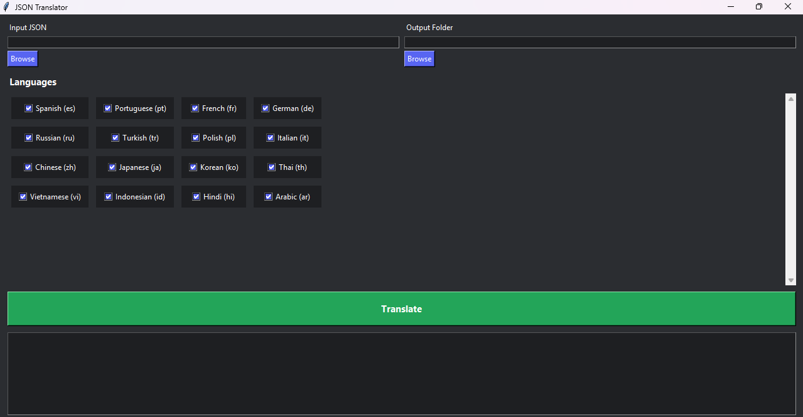

# JSON Multi-Language Translator GUI

A dark-theme GUI tool for translating JSON localization files into multiple languages using a local LibreTranslate server.



Supports:

* Multi-language batch translation
* Placeholder-safe translation (`{name}`, `{count}` etc.)
* Nested JSON structures
* Language checkbox grid (scrollable)
* Dark Discord-style UI
* Selectable output folder
* Progress log

---

# Requirements

* Python **3.9+**
* Running LibreTranslate server (local)
* Internet **NOT required** (runs locally)

---

# Install Dependencies

Install Python packages:

```bash
pip install requests
```

Tkinter is included with Python by default.
If missing (Linux):

```bash
sudo apt install python3-tk
```

---

# Start LibreTranslate (Required)

You must run LibreTranslate locally:

### Option 1 — Docker (recommended)

```bash
docker run -ti --rm -p 5000:5000 libretranslate/libretranslate
```

### Option 2 — Python install

```bash
pip install libretranslate
libretranslate
```

Server should run at:

```
http://localhost:5000
```

---

# Run the App

```bash
python translator_gui.py
```

---

# How To Use

### 1. Select Input JSON

Click **Browse** and choose:

```
en.json
```

Example:

```json
{
  "menu": {
    "play": "Play",
    "exit": "Exit"
  }
}
```

---

### 2. Select Output Folder

Choose where translated files will be saved:

```
/translations/
```

Output:

```
es.json
fr.json
ja.json
ru.json
```

---

### 3. Select Languages

Languages are shown in a **scrollable grid**.

* Checked = translated
* Unchecked = skipped
* Default languages pre-selected

---

### 4. Click Translate

The app will:

```
en.json → es.json
en.json → fr.json
en.json → ja.json
...
```

Progress appears in log window.

---

# Supported Features

### Placeholder Safe

Input:

```
"You have {count} coins"
```

Output:

```
"Tienes {count} monedas"
```

Placeholders are preserved.

---

### Nested JSON Safe

Input:

```json
{
  "ui": {
    "menu": {
      "play": "Play"
    }
  }
}
```

Output remains structured.

---

### Skipped Sections

This section will not translate:

```json
"Digits": {
  "0": "0",
  "1": "1"
}
```

---

# Supported Languages (default)

* Spanish
* Portuguese
* French
* German
* Russian
* Turkish
* Polish
* Italian
* Chinese
* Japanese
* Korean
* Thai
* Vietnamese
* Indonesian
* Hindi
* Arabic

You can toggle any.

---

# Output Example

```
translations/
 ├── es.json
 ├── fr.json
 ├── ja.json
 ├── ru.json
 └── zh.json
```

---

# Performance Notes

Speed depends on:

* JSON size
* Number of languages
* CPU speed

Example:

| Strings | Languages | Time    |
| ------- | --------- | ------- |
| 1000    | 5         | ~20 sec |
| 1000    | 10        | ~40 sec |
| 3000    | 16        | ~2 min  |

---

# Optional: Build EXE

Windows standalone:

```bash
pip install pyinstaller
```

Build:

```bash
pyinstaller --onefile --noconsole translator_gui.py
```

Output:

```
dist/translator_gui.exe
```

No Python required for users.

---

# Troubleshooting

### Connection refused

Make sure LibreTranslate running:

```
http://localhost:5000
```

---

### UI freezes

Large JSON — this is normal.
Translation runs in background thread.

---

### Missing translations

Some languages require models downloaded first.
LibreTranslate downloads automatically.

---

# License

Free for personal and commercial use.
